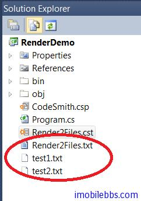

# CodeTemplate 对象

在使用代码模板产生代码时，CodeSmith 引擎背后使用了不少对象来帮助代码的生成，其中常用的有

- CodeTempate （类似于 Asp.Net 的 Page 类）
- Progress 用于显示代码生成的进度
- CodeTemplateInfo 可以返回关于当前模板自身的一些信息。

本篇介绍 CodeTemplate ，CodeTemplate 代表了由 CodeSmith 引擎处理的代码模板对象，可以通过 CodeTemplate 对象直接和 CodeSmith 引擎交互，比如：

- 使用 [GetFileName](http://docs.codesmithtools.com/display/Generator/Overriding+the+GetFileName+Method) 修改模板生成的缺省文件名
- 使用 [Render method](http://docs.codesmithtools.com/display/Generator/Overriding+the+Render+Method) 把模板的输出到多个文件中
- 通过 [events](http://docs.codesmithtools.com/display/Generator/Template+Events)   把代码插入到 CodeSmith 引擎处理模板的过程中。
- 通过 [Response](http://docs.codesmithtools.com/display/Generator/The+Response+Property) 属性直接在输出文件中写内容。

## 使用 [GetFileName](http://docs.codesmithtools.com/display/Generator/Overriding+the+GetFileName+Method) 修改模板输出的文件名

在前面的例子 [CodeSmith 使用教程(2): 编写第一个代码模板](http://www.imobilebbs.com/wordpress/archives/4182)，我们已经使用 GetFileName 修改过输出的文件名，比如在你的模板中定义了一个 ClassName 属性，可以通过 GetFileName 把模板输出的缺省文件名改成类名

```
<%@ Template Language="C#" TargetLanguage="Text" %>
<%@ Property Name="ClassName" Type="System.String" Default="ClassName" %>
```

This template shows off how to override the GetFileName method.

```
<script runat="template">
public override string GetFileName()
{
    return ClassName + ".cs";
}
</script>
```

## 重载 ParseDefaultValue 方法

在定义属性的缺省值时，有时有些属性的缺省值可能无法从 String 转换，此时可以通过重载ParseDefaultValue 方法，这个方法会被 CodeSmith 引擎中处理每个属性时调用，如果你重载了这个方法，可以按照你自己的逻辑来处理属性的缺省值。

## 重载 Render 方法

CodeTemplate 的 Render 方法是 CodeSmith 引擎生成最终输出时调用的，可以通过重载这个方法来修改输出的内容或是把输出写到多个文件中。
比如下面代码除了生成缺省的输出外，还把输出写到另外两个文件中：

```
<%@ CodeTemplate Language="C#" TargetLanguage="Text"
   Description="AddTextWriter Demonstration." %>
<%@ Import Namespace="System.IO" %>
//This template demonstrates using the AddTextWriter method
//to output the template results to multiple locations concurrently.
<script runat="template">
public override void Render(TextWriter writer)
    {
        StreamWriter fileWriter1 = new StreamWriter(@"test1.txt", true);
        this.Response.AddTextWriter(fileWriter1);

        StreamWriter fileWriter2 = new StreamWriter(@"test2.txt", true);
        this.Response.AddTextWriter(fileWriter2);

        base.Render(writer);

        fileWriter1.Close();
        fileWriter2.Close();
    }
</script>
```



注意调用基类的 base.Render，否则你就不会输出到缺省的文件。本例[下载](http://www.imobilebbs.com/download/codesmith/RenderDemo.zip)

## 模板事件

CodeTemplate 类定义了下面几个事件，你可以中这些事件发生时添加自动的事件处理。

- [OnInit](http://docs.codesmithtools.com/display/Generator/The+OnInit+Event) 事件帮助中代码模板创建时
- [OnPreRender](http://docs.codesmithtools.com/display/Generator/The+OnPreRender+Event) 事件发生在准备写输出文件前
- [OnPostRender](http://docs.codesmithtools.com/display/Generator/The+OnPostRender+Event) 事件发生在准备写输出文件后
- [OnPropertyChanged](http://docs.codesmithtools.com/display/Generator/The+OnPropertyChanged+Events) 事件发生在属性值发生变化时.

## 使用 Response 对象

和 Asp.Net 的 Page 对象一样，可以通过 CodeTemplate 的 Response 属性直接在输出流中写入内容。比如

```
<%@ CodeTemplate Language="C#" TargetLanguage="Text"
Description="This template demonstrates writing directly to the Response property" %>
<% RenderDirect(); %>
<script runat="template">
public void RenderDirect()
{
Response.WriteLine("Written directly to the Response property.");
Response.WriteLine("Hello " + System.Environment.UserName + "!");
}
</script>
```

直接在输出流中写入两行文字。Response 对象的类型为 CodeTemplateWriter 类 ，常用的方法有：

- AddTextWriter -添加额外的输出位置
- Indent – 为输出添加一个缩进
- Unindent – 为输出减少一个缩进
- Write -写入内容
- WriteLine – 写入内容并添加分行符

Tags: [CodeSmith](http://www.imobilebbs.com/wordpress/archives/tag/codesmith)
