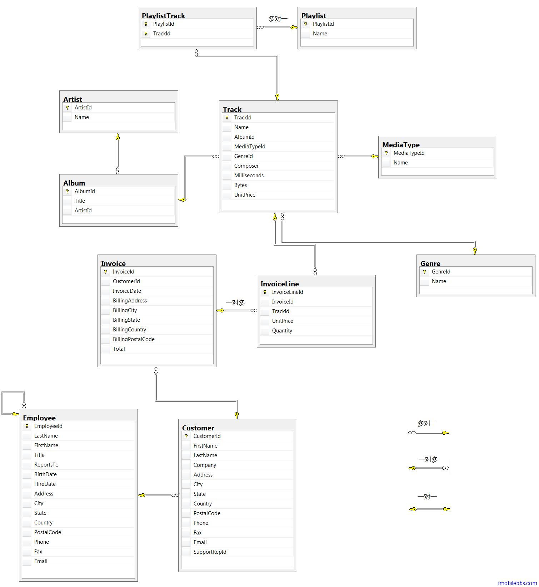
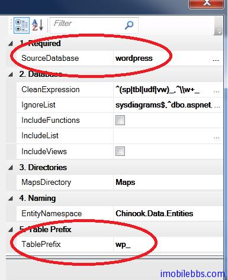

# 为 Yii Framework 创建生成 ActiveRecord 的代码模板

在 [CodeSmith 使用教程(3): 自动生成 Yii Framework ActiveRecord](http://www.imobilebbs.com/wordpress/archives/4196) 我们通过 SchemaExploer 为 Yii Framework 从数据库生成简单的 ActiveRecord 类，没有考虑到表和表之间的关系。本例我们使用 CodeSmith 为 Yii Framework 创建一个通用的代码模板，可以使用上例介绍的[SchemaExploer](http://www.imobilebbs.com/wordpress/archives/4238) ，不过在查看 CodeSmith 自带的例子中有个生成 Hibernate 的例子，这个模板的使用可以参见 CodeSmith 使用教程(1): [概述](http://www.imobilebbs.com/wordpress/archives/3549) ，CodeSmith 提供了这个模板的源码，使用到了 CodeSmith.SchemaHelper （CodeSmith 没有提供相应的文档），不过可以通过阅读 NHiberante 的模板了解其一般用法。

为生成 Yii Framework ActiveRecord 类之间的 relation ，先要了解一下表和表之间的关系：

两个 AR 类之间的关系直接通过 AR 类所代表的数据表之间的关系相关联。 从数据库的角度来说，表 A 和 B 之间有三种关系：一对多（one-to-many，例如 tbl_user 和 tbl_post），一对一（ one-to-one 例如 tbl_user 和tbl_profile）和 多对多（many-to-many 例如 tbl_category 和 tbl_post）。 在 AR 中，有四种关系：

- BELONGS_TO（属于）: 如果表 A 和 B 之间的关系是一对多，则 表 B 属于 表 A (例如 Post 属于 User);
- HAS_MANY（有多个）: 如果表 A 和 B 之间的关系是一对多，则 A 有多个 B (例如 User 有多个 Post);
- HAS_ONE（有一个）: 这是 HAS_MANY 的一个特例，A 最多有一个 B (例如 User 最多有一个 Profile);
- MANY_MANY: 这个对应于数据库中的 多对多 关系。 由于多数 DBMS 不直接支持 多对多 关系，因此需要有一个关联表将 多对多 关系分割为 一对多 关系。 在我们的示例数据结构中，tbl_post_category 就是用于此目的的。在 AR 术语中，我们可以解释 MANY_MANY 为 BELONGS_TO 和 HAS_MANY 的组合。 例如，Post 属于多个（belongs to many） Category ，Category 有多个（has many） Post.

本例还是使用 Chinook 数据库，修改 [Yii Framework 开发教程(27) 数据库-关联 Active Record 示例](http://www.imobilebbs.com/wordpress/archives/4052)。数据表之间的关系如下：



CodeSmith 中 PLINQO-NH 代码位置：

缺省目录为 C:\Program Files (x86)\CodeSmith\v6.5\Samples\Templates\Frameworks\PLINQO-NH


CodeSmith.SchemaHelper 定义的主要类有：


几个主要的类为

- EntityManager 管理所有的 Entity（对应于整个数据库）
- Entity 实体类（对应到单个表，视图）
- IAssoication 关系（定义表和表之间的关系）
- AssoicationType 关系的类型 (见下表）

根据 AssociationType ，数据库之间的关系以及 Yii AR 支持的几种关系，可以定义下表：


整个模板也是[采用主-从模板的方式](http://www.imobilebbs.com/wordpress/archives/4229)，主模板枚举 EntityManager 中的每个 Entity，然后调用子模板为每个表
生成 AR 类：

```
public void Generate()
{
   EntityManager entityManager = CreateEntityManager();
   foreach(IEntity entity in entityManager.Entities)
	{
		if (!(entity is CommandEntity)) {
			RenderEntity(entity);
		}
	}
}
```

...

```
private void RenderEntity(IEntity entity)
{

	string folder=@"../models/";
	EntityTemplate entityTemplate = this.Create<EntityTemplate>();
	entityTemplate.SourceEntity = entity;
	entityTemplate.RenderToFile(folder+entity.Name+".php", true);
}
```

子模板则根据每个 Entity 的 Assoications(关系属性）为 AR 生成 relations 函数，

```
<?php

class <%= SourceEntity.Name %> extends CActiveRecord
{
	public static function model($className=__CLASS__)
	{
		return parent::model($className);
	}

	public function tableName()
	{
		return '<%= SourceEntity.GetSafeName() %>';
	}

    <%if (SourceEntity.Associations.Count>0){ %>
    public function relations()
	{
		return array(
 		 <% IEnumerable<IAssociation> associations = SourceEntity.Associations; %>
         <% foreach(IAssociation association in associations) { %>
         <% if(association.Entity.Name!=association.ForeignEntity.Name) {%>
            <% if (association.AssociationType == AssociationType.ManyToOne
                || association.AssociationType==AssociationType.ManyToZeroOrOne) { %>
            '<%= ToCameral(association.Name) %>'=>array(self::BELONGS_TO,
			'<%= association.ForeignEntity.Name %>',
			<%=GetBelongToKey(association) %>
            <% } %>
            <% if (association.AssociationType == AssociationType.OneToMany
                || association.AssociationType==AssociationType.ZeroOrOneToMany) { %>
            '<%= ToCameral(association.Name) %>'=>array(self::HAS_MANY,
			'<%= association.ForeignEntity.Name %>',
			<%=GetKey(association) %>
            <% } %>
            <% if (association.AssociationType == AssociationType.OneToOne
                || association.AssociationType==AssociationType.OneToZeroOrOne) { %>
            '<%= ToCameral(association.Name) %>'=>array(self::HAS_ONE,
			'<%= association.ForeignEntity.Name %>',
			<%=GetKey(association) %>
            <% } %>
            <% if (association.AssociationType == AssociationType.ManyToMany) { %>
            '<%= ToCameral(association.Name) %>'=>array(self::MANY_MANY,
			'<%= association.IntermediaryAssociation.Entity.Name %>',
			<%=GetManyToManyKey(association) %>
            <% } %>
         <% } %>
     <% } %>
		);
	}
    <% } %>
}

?>

<script runat="template">

public string ToCameral(string name)
{
    return StringUtil.ToCamelCase(name);
 }

public string GetKey(IAssociation association)
{
    string retString=string.Empty;

    if(association.Properties.Count>1)
    {
        retString="array(";
        foreach (AssociationProperty associationProperty in association.Properties)
        {
            retString+="'"+associationProperty.ForeignProperty.GetSafeName()+"',";
        }
        retString+="),";
    }else{
        foreach (AssociationProperty associationProperty in association.Properties)
        {
            retString+="'"+associationProperty.ForeignProperty.GetSafeName()+"'),";
        }

    }
    return retString;
}

public string GetBelongToKey(IAssociation association)
{
    string retString=string.Empty;

    if(association.Properties.Count>1)
    {
        retString="array(";
        foreach (AssociationProperty associationProperty in association.Properties)
        {
            retString+="'"+associationProperty.Property.GetSafeName()+"',";
        }
        retString+="),";
    }else{
        foreach (AssociationProperty associationProperty in association.Properties)
        {
            retString+="'"+associationProperty.Property.GetSafeName()+"'),";
        }

    }
    return retString;
}

public string GetManyToManyKey(IAssociation association)
{

    string retString="'"+association.ForeignEntity.GetSafeName()+"(";

    foreach (AssociationProperty associationProperty in association.Properties)
    {
        retString+=associationProperty.ForeignProperty.GetSafeName()+",";
    }
    IAssociation intermidateAssociation=association.IntermediaryAssociation;
    if(intermidateAssociation!=null)
    {
           foreach (AssociationProperty associationProperty in intermidateAssociation.Properties)
        {
            retString+=associationProperty.ForeignProperty.GetSafeName()+",";
        }
    }

    retString=retString.Substring(0,retString.Length-1);
    retString+=")'),";
    return retString;
}
</script>
```

然后 generated output 就可以为数据库的表生成对应的 AR 类，比如生成的 Track 类

```
class Track extends CActiveRecord
{
	public static function model($className=__CLASS__)
	{
		return parent::model($className);
	}

	public function tableName()
	{
		return 'track';
	}

    public function relations()
	{
		return array(
            'album'=>array(self::BELONGS_TO,'Album','AlbumId'),
            'genre'=>array(self::BELONGS_TO,'Genre','GenreId'),
            'mediatype'=>array(self::BELONGS_TO,'Mediatype','MediaTypeId'),
            'invoicelines'=>array(self::HAS_MANY,'Invoiceline','TrackId'),
            'playlists'=>array(self::MANY_MANY,'Playlist','playlisttrack(TrackId,PlaylistId)'),
		);
	}
}
```

如果实在看不懂本例也无所谓，可以直接使用该模板，只要设置数据源 ，如果数据库的表有前缀，比如Wordpress 的表有 wp_ 可以设置表前缀（不是必须的）



本例[下载](http://www.imobilebbs.com/download/codesmith/RelationalActiveRecordDemo.zip) ，如果需要使用本例的模板，直接把项目中 protected 下的codesmith 目录拷贝到你自己的项目中，然后为 codesmith.csp 配置数据源（或者还有表前缀），然后生成代码即可。


本例[下载](http://www.imobilebbs.com/download/codesmith/RelationalActiveRecordDemo.zip)

Tags: [CodeSmith, Yii](http://www.imobilebbs.com/wordpress/archives/tag/codesmith)

