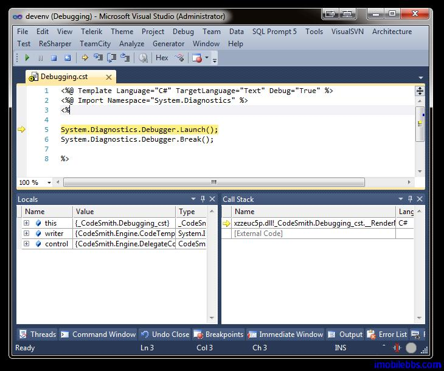

# 调试

编写 CodeSmith 模板和编写程序一样，也需要进行调试，CodeSmith 支持使用 CLR’s Just-in-Time debugger 调试模板。

要调试模板，首先要在 CodeTemplate 声明中打开调试 Debug=”True”：
```
<%@ CodeTemplate Language="C#" TargetLanguage="C#" Debug="True" %>
```

第二步是设置断点：在需要设置断点的地方调用 System.Diagnostics.Debugger.Break();

```
System.Diagnostics.Debugger.Launch();
System.Diagnostics.Debugger.Break();
```

在调用 System.Diagnostics.Debugger.Break();之前需要首先调用System.Diagnostics.Debugger.Launch();

这样在 Generate Output 时 Visual Studio 在指定的断点暂停运行：



此外也可以利用 .Net 的 System.Diagnostics.Trace 和 System.Diagnostics.Debug 添加调试信息。

Tags: [CodeSmith](http://www.imobilebbs.com/wordpress/archives/tag/codesmith)