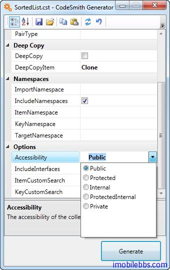

# 基本语法-声明和使用属性

CodeSmith 的核心是模板，而使模板具有活力的就是属性，通过定义属性从而使代码模板能够根据配置生成所需的代码。在使用代码模板时首先也必须给模板定义的属性定义值才能使用 CodeSmith 通过模板产生代码。有些属性具有缺省值，这些属性可以不需要配置。
模板中的属性通过 Property 指令来定义：

```
<%@ Property Name="ClassName" Type="String" Default="Class1" Category="Context"   Description="The name of the class to generate" Optional="true" %>
```

属性参数的介绍：

- Name：模版使用的参数的名称。
- Type：参数类型可以是任何 .NET 有效的数据类型，例如简单的 String 类型或者是 CodeSmith 的 SchemaExplorer.DatabaseSchema 类型。注意，类型必须是基类库的类型，例如用 String 或者Int32 代替 string 和 int。
- Default：设置默认值。
- Category：用来说明这个属性在 CodeSmith Explorer 的属性面板中显示成什么类型，例如下拉选择、直接输入等。
- Description：在属性面板中对于这个属性的描述。
- Optional：设置这个属性是否是必须的，设置为 True 表明这个参数值可有可无，设置为 False 则这个参数必须有值。
- Editor：表明在属性面板中输入这个属性的值时使用何种 GUI（图形界面编辑器）编辑器。
- EditorBase：编辑器使用的基本类型，如果没有被说明，UITypeEditor 为默认编辑器。
- Serializer 定义用于属性的 IPropertySerializer 类型。
- OnChanged 为属性发生变化时定义事件处理代码。
- DeepLoad 只用在 [SchemaExplorer](http://docs.codesmithtools.com/display/Generator/Using+SchemaExplorer) 对象，当为 True，[SchemaExplorer](http://docs.codesmithtools.com/display/Generator/Using+SchemaExplorer) 一次性取得有关数据库 Schema 的所有信息而避免多次查询数据库。

在配置属性时，每个属性根据其类型和 Editor 不同而使用不同的配置界面，对应一些简单的类型，比如 Int，String 可以直接编辑，而对于数据库类型可以使用 Schema Explorer，CodeSmith 预先定义了一些属性编辑器，此外也可以通过自定义为某些特殊的属性类型定义新的属性编辑器，这在后面再介绍。通常情况下无需自定义。

在某些情况下，如果所定义的属性值为一个列表中的某个值，比如在 CodeSmith 自带的模板 SortedList.cst 中定义了一个属性用来为所生成的类设置可见性：



这可以通过定义一个枚举类型来实现：

```
<script runat="template">
Public Enum AccessibilityEnum
      [Public]
      [Protected]
      [Friend]
      [ProtectedFriend]
      [Private]
End Enum
</script>
```

然后为所定义的属性的类型定义为这个枚举类型：

```
<%@ Property Name="Accessibility" Type="AccessibilityEnum"
Category="Options" Description="The accessibility of the class to be generated." %>
```

由于属性可以定义为可选（Optional），因此在模板中需要检测某个的属性是否配置过，比如下面定义了一个属性为 Optional

```
<%@ Property Name="ClassNamespace" Type="System.String" Optional="True" 
Category="Context" 
Description="The namespace that the generated class will be a member of." %>
```

在模板中脚本需要检测这个属性是否有值可以通过下面代码来实现：

```
<% if (ClassNamespace != null && ClassNamespace.Length > 0)
{ %>namespace <%= ClassNamespace %>{<% }
%>
```

从上面也可以看出，在脚本中使用属性直接使用属性名字即可，无需加前缀（比如$之类的前缀）。

Tags: [CodeSmith](http://www.imobilebbs.com/wordpress/archives/tag/codesmith)


