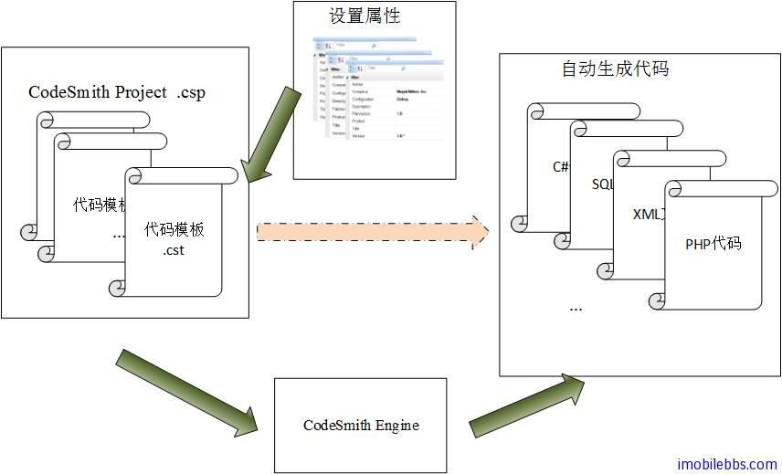
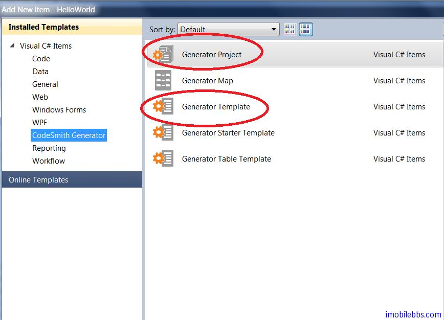
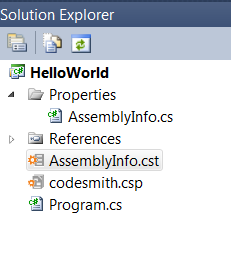
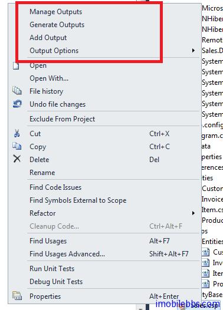
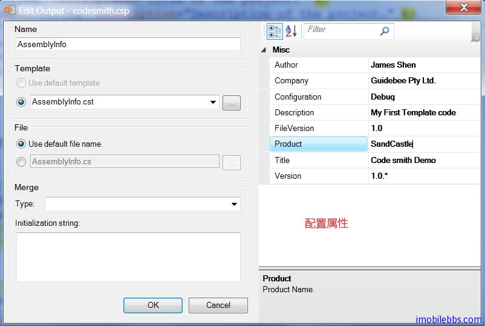

# 编写第一个代码模板

在[CodeSmith 使用教程(1): 概述](http://www.imobilebbs.com/wordpress/archives/3549)我们通过使用 CodeSmith 从数据库自动生成 NHiberate 代码，可以了解到使用 CodeSmith 自动生成代码的基本步骤：

1. 选择使用合适的模板，CodeSmith 随开发包自带了大量常用的模板，如果找不到合适的模板，CodeSmith 支持自定义模板。
2. 为模板选择合适的参数设置。
3. 自动生成代码（可以为任意类型的代码，C#，Java, .XML 文本等）



其核心为代码模板文件，随 CodeSmith 自带了不少常用的模板，可以通过模板浏览器来查询，此外网上也有很多第三方开发的模板，在使用前可以先查查是否已有现成的模板，或是可以通过修改现有的模板来完成自动生成代码的需要。

在开发应用时，很多人都喜欢通过复制以前的项目中的代码，然后通过修改以满足新项目，这些重用的代码通常具有很多共性（可以想想 C++ 的模板类，C# 的 Generic 等），CodeSmith 就是用来为这些具有相似性的代码创建模板，然后通过设置属性（代码直接的不同点），就可以自动创建所需代码。

本例通过一个简单的例子来介绍创建一个自定义代码模板的方法。CodeSmith 提供了 Visual Studio的集成开发环境的支持，本例也是通过创建模板自动生成简化每个的 C# 项目都需要的   AssemblyInfo.cs，在开发 C# 应用时，一般是通过手工修改 AssemblyInfo.cs 的中属性（或者是 Copy & Paste ：-）).

首先我们使用 Visual Studio 创建一个 C# HelloWorld 下面（Console 或是 WinForm 项目都可以），可以打开项目中的 AssemblyInfo.cs

```
using System.Reflection;
using System.Runtime.CompilerServices;
using System.Runtime.InteropServices;

// General Information about an assembly is controlled through the following
// set of attributes. Change these attribute values to modify the information
// associated with an assembly.
[assembly: AssemblyTitle("HelloWorld")]
[assembly: AssemblyDescription("")]
[assembly: AssemblyConfiguration("")]
[assembly: AssemblyCompany("Microsoft")]
[assembly: AssemblyProduct("HelloWorld")]
[assembly: AssemblyCopyright("Copyright © Microsoft 2013")]
[assembly: AssemblyTrademark("")]
[assembly: AssemblyCulture("")]

// Setting ComVisible to false makes the types in this assembly not visible
// to COM components.  If you need to access a type in this assembly from
// COM, set the ComVisible attribute to true on that type.
[assembly: ComVisible(false)]

// The following GUID is for the ID of the typelib if this project is exposed to COM
[assembly: Guid("72797715-64b9-4bab-a49f-f55e8a0a18d7")]

// Version information for an assembly consists of the following four values:
//
//      Major Version
//      Minor Version
//      Build Number
//      Revision
//
// You can specify all the values or you can default the Build and Revision Numbers
// by using the '*' as shown below:
// [assembly: AssemblyVersion("1.0.*")]
[assembly: AssemblyVersion("1.0.0.0")]
[assembly: AssemblyFileVersion("1.0.0.0")]
```

为了使用 CodeSmith，我们在 HelloWorld 中添加 CodeSmith 的项目文件并创建一个模板文件AssemblyInfo.cst



创建好的项目文件如下：



编写 CodeSmith 的代码模板和编写 Asp.Net 的 Page 非常类似，CodeSmith 支持以 C#，VB.Net和 JavaScript 做为脚本语言来编写模板，本例使用 C# 做为脚本语言（源代码/语言），计划生成的也是 C# 语言（目标代码/语言），打开 AssemblyInfo.cst，修改代码为

```
<%@ CodeTemplate Language="C#" TargetLanguage="C#" Description="Create an AssemblyInfo.cs file." %>
```

每个 CodeSmith 的代码模板都是以 [CodeTemplate](http://docs.codesmithtools.com/display/Generator/The+CodeTemplate+Directive) 开始，定义代码模板使用的源语言，目标语言和简单的描述。

然后将这个模板添加到 CodeSmith 项目中，可以右键单击 codesmith.csp ,选择 Add output




这时 CodeSmith 的项目将创建好了，但单击”Generate code”不会生成任何代码，因为我们的代码模板 AssemblyInfo.cst 没做任何事。

创建代码模板可以从生成的结果开始，可以直接先把要生成的代码复制到代码模板 AssemblyInfo.cst中，比如：

```
using System.Reflection;
using System.Runtime.CompilerServices;
//
// Created: 1/1/2013
// Author: James Shen
//
[assembly: AssemblyTitle("User storage utility")]
[assembly: AssemblyDescription("Helps manage data in Isolated Storage files.")]
[assembly: AssemblyConfiguration("Retail")]
[assembly: AssemblyCompany("Guidebee Pty Ltd, Inc.")]
[assembly: AssemblyProduct("StorageScan")]
[assembly: AssemblyCopyright("Copyright (c) Guidebee Pty Ltd.")]
[assembly: AssemblyCulture("")]
[assembly: AssemblyVersion("1.0.*")]
[assembly: AssemblyFileVersion("1.0")]
[assembly: AssemblyDelaySign(true)]
```

可以把要生成的代码模板的内容分成三部分：

- 固定内容
- 可以通过代码动态生成的部分（如上面的日期）
- 需要用户提供属性配置的部分

此时如果使用 Codesmith 的 Generate Codes, 将自动生成 AssemblyInfo.cs (缺省为模板名），不过 AssemblyInfo.cs 位置不是我们所需的 Properties/AssemblyInfo.cs, 这可以通过重载代码模板的 GetFileName 方法来实现：

```
<%@ CodeTemplate Language="C#" TargetLanguage="C#"
  Description="Create an AssemblyInfo.cs file." %>
...
<script runat="template">
public override string GetFileName() {
    return "Properties/AssemblyInfo.cs";
}
</script>
```

这样在使用 CodeSmith 项目的 Generate Codes，就自动覆盖原来的 Properties/AssemblyInfo.cs 文件。 内容就是模板中的代码部分。

但每次生成的代码都是固定的，作为模板来说没有什么灵活性，下面我们可以通过检查模板的内容，觉定那些内容是可变的。比如 AssemblyInfo.cs 的日期和 Assembly 的各个属性对于不同的项目来说是可变的。

这些可变的内容其中一部分可以通过代码自动生成（如日期），有一部分需要用户来配置，比如AssemblyTitle，AssemblyDescription 等。

对于日期部分可以通过C#代码实现如下：

```
// Created: <%= DateTime.Now.ToLongDateString() %>
```

可以看出来 CodeSmith 的模板文件如 AssemblyInfo.cst 和 Asp.Net 的 Page 文件中功能是非常类似，可以通过<%= 和%>直接嵌入 C# 代码（或 VB.Net，JavaScripts)。

对于属性来说，可以通过先定义属性：

```
<%@ Property Name="Author" Type="System.String" Description="Lead author of the project." %>
<%@ Property Name="Title" Type="System.String" Description="Title of the project." %>
<%@ Property Name="Description" Type="System.String" Description="Description of the project." %>
<%@ Property Name="Configuration" Type="System.String" Default="Debug" Description="Project configuration." %>
<%@ Property Name="Company" Type="System.String" Default="Guidebee Pty Ltd." %>
<%@ Property Name="Product" Type="System.String" Description="Product Name." %>
<%@ Property Name="Version" Type="System.String" Default="1.0.*" Description=".NET assembly version." %>
<%@ Property Name="FileVersion" Type="System.String" Default="1.0" Description="Win32 file version." %>
```

属性定义通过 Property 定义，Name 定义属性名，Type 为属性的数据类型，Default 定义属性的缺省值， Description 可以定义属性的作用及说明。

然后就可以在 C# 代码中使用这些属性，完整的代码模板如下：

```
<%@ CodeTemplate Language="C#" TargetLanguage="C#" Description="Create an AssemblyInfo.cs file." %>
<%@ Property Name="Author" Type="System.String" Description="Lead author of the project." %>
<%@ Property Name="Title" Type="System.String" Description="Title of the project." %>
<%@ Property Name="Description" Type="System.String" Description="Description of the project." %>
<%@ Property Name="Configuration" Type="System.String" Default="Debug" Description="Project configuration." %>
<%@ Property Name="Company" Type="System.String" Default="Guidebee Pty Ltd." %>
<%@ Property Name="Product" Type="System.String" Description="Product Name." %>
<%@ Property Name="Version" Type="System.String" Default="1.0.*" Description=".NET assembly version." %>
<%@ Property Name="FileVersion" Type="System.String" Default="1.0" Description="Win32 file version." %>
using System.Reflection;
using System.Runtime.CompilerServices;
//
// Created: <%= DateTime.Now.ToLongDateString() %>
// Author:  <%= Author %>
//
[assembly: AssemblyTitle("<%= Title %>")]
[assembly: AssemblyDescription("<%= Description %>")]
[assembly: AssemblyConfiguration("<%= Configuration %>")]
[assembly: AssemblyCompany("<%= Company %>")]
[assembly: AssemblyProduct("<%= Product %>")]
[assembly: AssemblyCopyright("Copyright (c) <%= DateTime.Now.Year.ToString() %> <%= Company %>")]
[assembly: AssemblyCulture("")]
[assembly: AssemblyVersion("<%= Version %>")]
[assembly: AssemblyFileVersion("<%= FileVersion %>")]
[assembly: AssemblyDelaySign(true)]
```
此时如果需要“Generate output” 首先要配置代码模板的属性，这通过”Manage output” 来完成，



次数如果打开 codesmith.csp 文件可以看到为 AssemblyInfo.cst 配置的属性内容：

```
<?xml version="1.0" encoding="utf-8"?>
<codeSmith xmlns="http://www.codesmithtools.com/schema/csp.xsd">
  <propertySets>
    <propertySet name="AssemblyInfo" template="AssemblyInfo.cst">
      <property name="Configuration">Debug</property>
      <property name="Company">Guidebee Pty Ltd.</property>
      <property name="Version">1.0.*</property>
      <property name="FileVersion">1.0</property>
      <property name="Author">James Shen</property>
      <property name="Title">Code smith Demo</property>
      <property name="Description">My First Template code</property>
      <property name="Product">SandCastle</property>
    </propertySet>
  </propertySets>
</codeSmith>
```

生成代码如下：

```
using System.Reflection;
using System.Runtime.CompilerServices;
//
// Created: Thursday, 3 January 2013
// Author:  James Shen
//
[assembly: AssemblyTitle("Code smith Demo")]
[assembly: AssemblyDescription("My First Template code")]
[assembly: AssemblyConfiguration("Debug")]
[assembly: AssemblyCompany("Guidebee Pty Ltd.")]
[assembly: AssemblyProduct("SandCastle")]
[assembly: AssemblyCopyright("Copyright (c) 2013 Guidebee Pty Ltd.")]
[assembly: AssemblyCulture("")]
[assembly: AssemblyVersion("1.0.*")]
[assembly: AssemblyFileVersion("1.0")]
[assembly: AssemblyDelaySign(true)]
```

本例[下载](http://www.imobilebbs.com/download/codesmith/HelloWorld.zip)

Tags: [CodeSmith](http://www.imobilebbs.com/wordpress/archives/tag/codesmith)