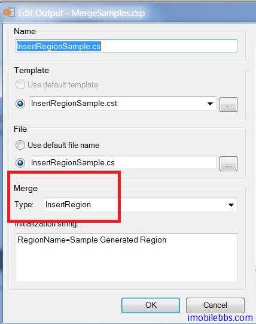
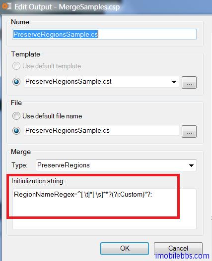

# Merge 策略

前面介绍了 CodeSmith 使用的基本用法，通过代码模板来生成代码，但如果你修改了自动生成的代码，再次使用代码模板生成代码后，你修改的代码也就丢失了，CodeSmith 支持多种“合并（Merge）”来解决这个问题，以保留你自己修该过的部分。

CodeSmith 支持如下三种“合并策略”：

- [InsertRegion Merge 策略](http://docs.codesmithtools.com/display/Generator/InsertRegion+Merge+Strategy)
- [PreserveRegions Merge 策略](http://docs.codesmithtools.com/display/Generator/PreserveRegions+Merge+Strategy)
- [InsertClass Merge 策略](http://docs.codesmithtools.com/display/Generator/InsertClass+Merge+Strategy)

不过这些策略主要是针对 C#，VB 这些支持 Region 的语言，对于其它语言可能就需要使用其它方法，比如自定义 Merge 策略，CodeSmith 允许通过 CodeSmith.Engine.IMergeStrategy 来扩展“合并”策略，本人推荐 CodeSmith 的一个原因就是 CodeSmith 提供了很多接口而不仅仅是一个工具，比如除了 CodeSmith 支持的属性，XML 属性，你也可以通过 CodeSmith.CustomProperties 来自定义属性种类，除了 CodeSmith 支持的数据源种类（MySQL，Oracle），你也可以通过自定义的 Schema Provider 支持新的数据库类型或是其它数据类型。

## InsertRegion 策略

InsertRegion 顾名思义，就是在源码中定义一个 Region，然后让 CodeSmith 自动生成的代码只插入到该区域，而在区域外的代码 CodeSmith 不会去碰它们，从而实现了自定义的代码和自动生成代码的合并。

## PreserveRegion 策略

PreserveRegion 是定义多个区域，然后通知 CodeSmith 保持这些区域代码不变，自动创建的代码添加到这些区域的外面，和 InsertRegion 作用相反。

下面还是借用 CodeSmith 自带的 Merge 示例说明一下这两种策略的基本用法：

首先是 InsertRegion 策略，定义一个类文件 InsertRegionSample.cs

```
public class InsertRegionsSample
{

    public void SomeCustomMethod()
	{
        // This is my custom code that I want to preserve.
        // I can make changes to it and my changes will
        // not be overwritten.
	}

	#region Sample Generated Region
// This region generated by CodeSmith on Saturday, 12 January 2013
	#endregion
}
```

其中定义了一个 Region，名为 Sample Generated Region ，准备让 CodeSmith 查入代码，编写一个简单的代码模板，插入当前时间：

```
<%@ Template Language="C#" TargetLanguage="C#"   Description="Demonstrates using an InsertRegion merge strategy in C#." %>
// This region generated by CodeSmith on <%= DateTime.Now.ToLongDateString() %>
```

然后通过 CodeSmith 项目为模板设置 Merge 策略：



选择 InsertRegion 策略， 然后设置要插入的 RegionName。

生成后的代码如下：

```
public class InsertRegionsSample
{

    public void SomeCustomMethod()
	{
        // This is my custom code that I want to preserve.
        // I can make changes to it and my changes will
        // not be overwritten.
	}

	#region Sample Generated Region
// This region generated by CodeSmith on Saturday, 12 January 2013
	#endregion
}
```

可以看到 CodeSmith 只在 Region 处插入代码，而该 Region 外的部分保持不变。

类似的 PreserveRegions 策略，代码和模板定义如下：
PreserveRegionsSample.cs

```
public class PreserveRegionsSample
{

#region "Custom Region 1"

	// This is a place holder for your custom code.
	// It must exist so that CodeSmith knows where
	// to put the custom code that will be parsed
	// from the target source file.
	// The region name is used to match up the regions
	// and determine where each region of custom code
	// should be inserted into the merge result.

#endregion

    public void SomeGeneratedMethod()
	{

        // This section and all other non-custom code
        // regions will be overwritten during each
        // template execution.
        // Current Date: Saturday, 12 January 2013
	}

#region "Custom Region 2"

    // The contents of this region will also be preserved
    // during generation.

#endregion

}
```

模板定义如下：

```
<%@ Template Language="C#" TargetLanguage="C#"    Description="Demonstrates using a PreserveRegions merge strategy in C#." %>
public class PreserveRegionsSample
{

#region "Custom Region 1"

	// This is a place holder for your custom code.
	// It must exist so that CodeSmith knows where
	// to put the custom code that will be parsed
	// from the target source file.
	// The region name is used to match up the regions
	// and determine where each region of custom code
	// should be inserted into the merge result.

#endregion

    public void SomeGeneratedMethod()
	{

        // This section and all other non-custom code
        // regions will be overwritten during each
        // template execution.
        // Current Date: <%= DateTime.Now.ToLongDateString() %>
	}

#region "Custom Region 2"

    // The contents of this region will also be preserved
    // during generation.

#endregion

}
```

模板中也定义了两个区域，然后为该模板设置 Merge 策略，使用 PreserveRegion 时可能有多个Region 需要保留，因此可以使用 RegX 来定义要保留的 Region：



本例[下载](http://www.imobilebbs.com/download/codesmith/MergeDemo.zip)

InsertClass 策略用在给以重载的代码中插入自动生成的代码,挺起来和 InsertRegion 功能很类似，的确也是如此，但 InsertClass 支持更多的配置，可以实现更加灵活和强大的功能。

它支持的配置有：


|Language               | String, Required         |	只支持VB和C#                                                           |
|:----------------------|:-------------------------|:-------------------------------------------------------------------------|
|ClassName	            |String, Required          |	需插入代码的类名.                                                       |
|PreserveClassAttributes|Boolean, defaults to False|	是否保留类已有的Attributes，缺省CodeSmith替代类原来的Attributes            |
|OnlyInsertMatchingClass|Boolean, defaults to False|	是否只插入匹配的类定义中                                                 |
|MergeImports           |Boolean, defaults to False|	是否合并Import语句                                                      |
|NotFoundAction	        |Enum, defaults to None    |	如果指定的类没找到后的行动，可以None,InsertAtBottom，InsertInParent几种选项 |
|NotFoundParent     	|String, no default	       |如果指定NotFoundAction为InsertInParent对应的父类名称.                         |

比如使用如下配置：

Language: C#
ClassName: “Pet”
PreserveClassAttributes: True
OnlyInsertMatchingClass: True
MergeImports: True

现有类定义：

```
using System;
using System.ComponentModel.DataAnnotations;
namespace Petshop
{
    [ScaffoldTable(true)]
    public class Pet
    {
        public int Age { get; set; }
        public string FirstName { get; set; }
        public string LastName { get; set; }
    }
}
```

自动生成的代码如下：

```
using System;
using System.Text;
namespace Petshop
{
    public class Pet
    {
        public string FirstName { get; set; }

        public string LastName { get; set; }

        public string FullName
        {
            get { return String.Format("{0} {1}", FirstName, LastName); }

        }
    }
}
```

使用 InsertClass 合并后的代码如下：

```
using System;
using System.ComponentModel.DataAnnotations;
using System.Text;
namespace Petshop
{
    [ScaffoldTable(true)]
    public class Pet
    {
        public string FirstName { get; set; }

        public string LastName { get; set; }

        public string FullName
        {
            get { return String.Format("{0} {1}", FirstName, LastName); }

        }
    }
}
```

Tags: [CodeSmith](http://www.imobilebbs.com/wordpress/archives/tag/codesmith)