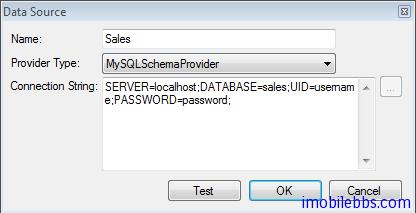
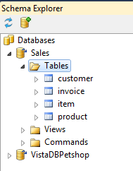
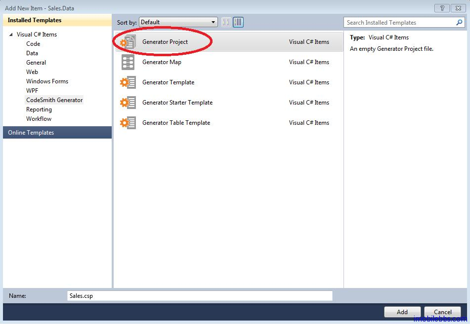
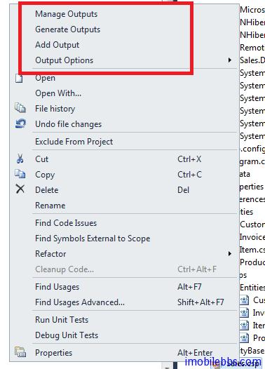
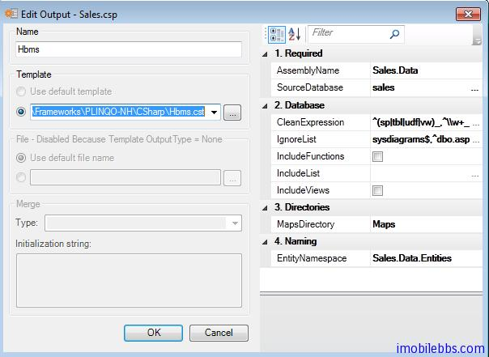
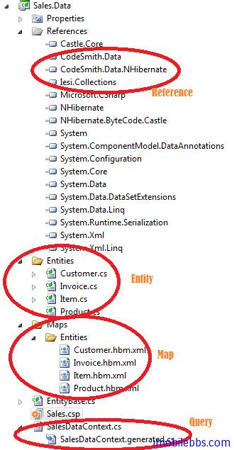
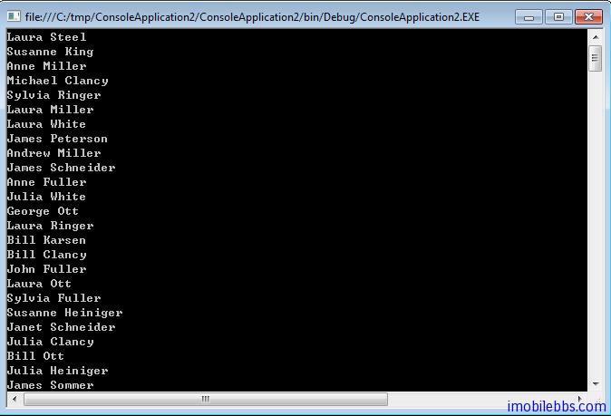

# 概述

前面正在介绍 hibernate 的开发教程，提到 hibernate 在 .Net 平台上相应的 ORM 工具为NHibernate，使用 NHibernate 就不能不提到 CodeSmith。

CodeSmith 是一种基于模板的代码生成工具，它使用类似于 ASP.NET 的语法来生成任意类型的代码或文本。与其他许多代码生成工具不同，CodeSmith 不要求您订阅特定的应用程序设计或体系结构。使用 CodeSmith，可以生成包括简单的强类型集合和完整应用程序在内的任何东西。当您生成应用程序时，您经常需要重复完成某些特定的任务，例如编写数据访问代码或者生成自定义集合。CodeSmith 在这些时候特别有用，因为您可以编写模板自动完成这些任务，从而不仅提高您的工作效率，而且能够自动完成那些最为乏味的任务。CodeSmith 附带了许多模板，包括对应于所有 .NET 集合类型的模板以及用于生成存储过程的模板，但该工具的真正威力在于能够创建自定义模板。

CodeSmith 可以从网站 http://www.codesmithtools.com/ 下载，个人开发版费用在300美元左右，个人认为还是物有所值。

还是用一个例子来说明一下使用 CodeSmith 可以大大减轻程序代码的工作量，对于数据库应用来说，尽管数据库表不尽相同，但基本过程都是定义数据库表，设计表对应的类，然后使用 ADO 或是 SQL 语句来访问数据库，创建对应的类对象等。

使用 CodeSmith 提供的模板，可以几乎不用手工编写一行代码，就可以自动生成上述数据库相关的代码。

本例使用 Visual Studio 2010 ，Codesmith 安装时提供了 Visual Studio 插件支持。使用的示例数据库也是 Sales，可以参见 [Hibernate 开发教程(2):准备开始。](http://www.imobilebbs.com/wordpress/archives/3545)

由于使用 MySQL 数据库，需要下载 [MySQL .Net 库](http://dev.mysql.com/downloads/connector/net/)。使用 SQL Server 可以直接使用。

1. 创建一个命令行应用 solution。

2. 使用 CodeSmith 的 Schema Explorer 添加一个 MySQL 数据源



这里的 Connection String 为： SERVER=localhost;DATABASE=sales;UID=username;PASSWORD=password;（根据你自己服务器自行修改参数）

添加成功后，在 Schema Explorer 中会显示所连接的数据库的表定义等



3. 在这个 solution 中添加一个 Sales.Data Class Library.然后在项目中添加一个 CodeSmith 项目 Item



4. 点击 Sales.csp 使用鼠标右键 Context Menu



使用有 Add Output 可以在项目中添加生成代码的模板，这里选用 CodeSmith 自带的 PLINQO-NH\CSharp 下的三个模板，

模板路径为..\Users\…\Documents\CodeSmith Generator\Samples\v6.5\Templates\Frameworks\PLINQO-NH\CSharp\

分别添加三个模板，SourceDatabase 选择 Schema Explorer 中添加的 Sales 数据库，其它属性使用缺省值。



三个模板分别为

- Hbms    生成 hbm.xml 映射文件
- Entities  生成和数据库表对应的.Net类定义
- Queries 生成查询数据对应的类

然后通过 Sales.csp 的 Generate code 生成代码。

可以看到 CodeSmith 自动生成了很多代码，并添加了所需的引用。



此时用来访问数据的类全部由 CodeSmith 生成，无需自己写一行代码。

5. 看看如果使用生成的代码来访问数据库，修改命令行应用的 Program.cs 的 main 函数，打印出所有 Customer 的姓名。

```
var salesDataContext = new SalesDataContext();
foreach (var s in salesDataContext.Customer.ToList()) 
{
	Console.WriteLine(s.FirstName+" " + s.LastName);
}
```

使用 SalesDataContext 中 Customer 查询对象。然后枚举列表中每个 Customer 对象并打印出FirstName 和 Last Name.可以看到代码自动完成了对数据库的读取访问。



由本例看到使用 CodeSmith 可以大大减轻手工代码量，其使用的一般步骤是

1. 选择使用合适的模板，CodeSmith 随开发包自带了大量常用的模板，如果找不到合适的模板，CodeSmith 支持自定义模板。
2. 为模板选择合适的参数设置。
3. 自动生成代码（可以为任意类型的代码，C#，Java, .XML 文本等）

后面将详细介绍 CodeSmith 使用的基本方法，CodeSmith 的核心为模板，因此重点在模板的设计和使用。

Tags: [CodeSmith](http://www.imobilebbs.com/wordpress/archives/tag/codesmith)
