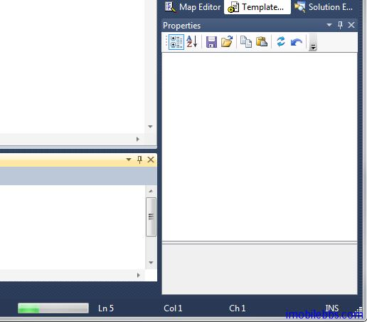

# Progress 对象

使用 Progress 对象可以为 CodeSmith 生成代码的过程显示一个进度条，这对于生成比较费时的模板操作是非常有用的，如果你使用 Visual Studio，可以在状态栏中显示一进度条：



使用进度条的方法是通过 CodeTemplate 对象的 Progress 属性对象，首先是设置 Progress 对象的最大值和步长，本例通过一个简单的循环来模拟一个费时的操作：

```
<%@ Template Language="C#" TargetLanguage="Text" Debug="False" %>

<%@ Import Namespace="System.Threading" %>
This is a progress demo.

<% SimulateProgress(); %>

<script runat="template">
public void SimulateProgress(){

Progress.MaximumValue = 25;
Progress.Step = 1;

    for(int i=0;i<25;i++){
        Progress.PerformStep();
        Thread.Sleep(100);
        Response.WriteLine("step {0} ",i);
    }
}
</script>
```

让进度条前进一步是通过 Progress 对象的 PerfStep 方法来实现的。

本例[下载](http://www.imobilebbs.com/download/codesmith/ProgressDemo.zip)

Tags: [CodeSmith](http://www.imobilebbs.com/wordpress/archives/tag/codesmith)