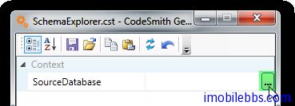
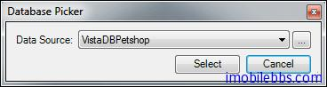
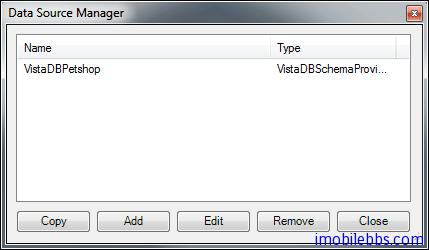
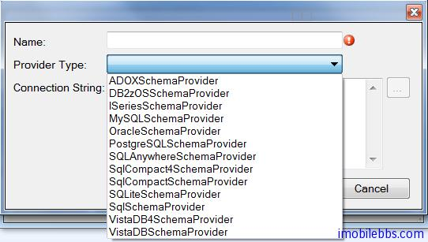
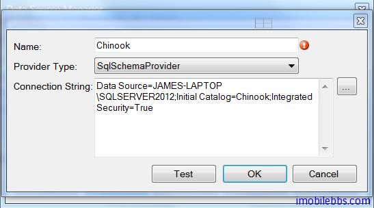
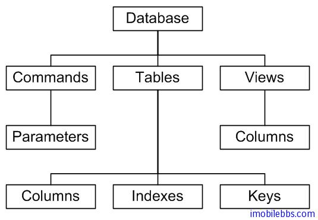
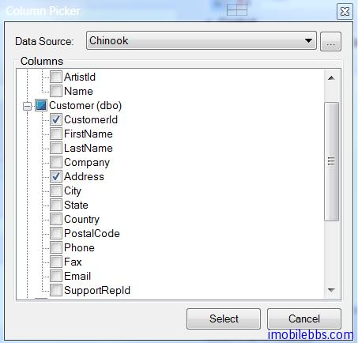

# 使用 SchemaExplorer 来获取数据库定义

| Contents  | 
|:----------|
| [1.表的列](http://www.imobilebbs.com/wordpress/archives/4238#)   | 
| [2.视图的列](http://www.imobilebbs.com/wordpress/archives/4238#) | 
| [3.命令参数](http://www.imobilebbs.com/wordpress/archives/4238#) |

在前面例子 CodeSmith 使用教程(3): 自动生成 Yii Framework ActiveRecord 我们使用了SchemaExplorer 来获取数据的 MetaData（数据库 Schema 定义）来自动生成 Yii Framework 的数据库表对应的 ActiveRecord 定义，本篇较详细的介绍一下的 SchemaExplorer 的用法，下一篇通过实例除了自动生成自动生成 Yii Framework 的数据库表对应的 ActiveRecord 定义外，还自动生成关联 ActiveRecord 的关系定义，也就是根据数据库表之间的关系（一对多，一对一，多对多）为ActiveRecord 定义 relations. 

CodeSmith 的 SchemaExplorer 定义在 Assembly SchemaExplorer.dll 中，其命名空间为SchemaExplorer ，因此如果需要使用 CodeSmith 的 SchemaExplorer 功能的话，需要添加对SchemaExplorer.dll 的引用，如下：

```
<%@ CodeTemplate Language="C#" TargetLanguage="Text" Description="List all database tables" %>
<%@ Property Name="SourceDatabase" Type="SchemaExplorer.DatabaseSchema"
 Category="Context" Description="Database containing the tables." %>
<%@ Assembly Name="SchemaExplorer" %>
<%@ Import Namespace="SchemaExplorer" %>
Tables in database "<%= SourceDatabase %>":
<% for (int i = 0; i < SourceDatabase.Tables.Count; i++) { %>
        <%= SourceDatabase.Tables[i].Name %>
<% } %>
```

以上代码添加了 SchemaExplorer 库的引用，并定义了一个属性 SourceDatabase，其类型为SchemaExplorer.DatabaseSchema ，在运行这个模板前，必须设置 SourceDatabase 的值：



SourceDatabase 属性后显示一个“…”的按钮，表示使用一个附加的专用的编辑器来定义这个属性，点击这个按钮将启动数据库选择对话框：




使用这个对象框可以选择已通过 Schema Explorer 定义过的数据库或者添加新的数据库，通过单击“…”来添加新的数据库定义：



如果添加一个新的数据源，SchemaExplorer 打开了 数据源对话库 ，选择合适的数据源类型：



CodeSmith 缺省支持的数据源类型有很多，包括了常用的 ADO， DB2,MySQL，Oracle，PostgreSQL， SQL Server，Sqlite 等，也可以自定义新的数据源类型。

本例我们选用 SQL Server 类型 ，并使用 [Chinook 示例数据库](http://chinookdatabase.codeplex.com/):




选择数据库 Chinook，显示结果：

Tables in database "Chinook":
        Album
        Artist
        Customer
        Employee
        Genre
        Invoice
        InvoiceLine
        MediaType
        Playlist
        PlaylistTrack
        Track
SchemaExplorer 对应数据库的 MetaData（表定义，列定义，主键，外键定义等）定义如下的对象模型，可以在代码模板中使用：



上图表示 SchemaExplorer 定义了多种对象集合类型，对象类型，比如 DatabaseSchema 定义了Commands 属性，
其类型为 CommandSchemaCollection，这个集合的每项类型为 CommandSchema ，对应到数据库定义中的一个命令。
通过这个属性可以获取 Command 的定义等信息。

使用 SchemaExplorer 除了可以使用 SchemaExplorer.DatabaseSchema 类型来定义属性，还可以通过下面四种类型
- TableSchema和 TableSchemaCollection
- ViewSchema 和 ViewSchemaCollection
- CommandSchema 和 CommandSchemaCollection
- ColumnSchema 和 ColumnSchemaCollection

分别对应到表类型，视图类型，命令类型，列类型，比如使用

```
<%@ Property Name="SourceColumns"  Type="SchemaExplorer.ColumnSchemaCollection"
Category="Database"  Description="Select a set of columns." %>
```

选择一个表的多个列（ColumnSchemaCollection）



对应这些集合类型（比如 TableSchemaCollection，ColumnSchemaCollection）缺省的排序是由数据库决定的，因此可能不是排好序的，如果需要排序的话，可以通过 Sort 方法来实现，比如：

```
TableSchemaCollection tables = new TableSchemaCollection(SourceDatabase.Tables);
tables.Sort(new PropertyComparer("Name"));
```

SQL Server 数据库可以对表或列定义一些附加的属性（Extended Property）SchemaExplorer 也提供了方法可以来访问/添加 这些 Extended Property。
比如 SQL Server 定义一个扩展属性表示某个列是否为 Identity 列，这可以通过下面代码来获取：

```
Identity Field = <% foreach(ColumnSchema cs in SourceTable.Columns) {
    if( ((bool)cs.ExtendedProperties["CS_IsIdentity"].Value) == true) {
        Response.Write(cs.Name);
    }
} %>
```

更好的方法是使用[SchemaExplorer.ExtendedPropertyNames](http://www.codesmithtools.com/help/##GeneratorAPI.chm/html/5d664b18-7a28-1210-813f-a5f56f92c8e9.htm)类和ExtendedProperty定义的扩展方法。

例如：

```
Identity Field = <% foreach(ColumnSchema cs in SourceTable.Columns) {
    if(cs.ExtendedProperties.GetByKey<bool>(SchemaExplorer.ExtendedPropertyNames.IsIdentity) == true) {
        Response.Write(cs.Name);
    }
} %>
```

CodeSmith 缺省支持的扩展属性如下：

表的列

|Extended Property Key|	SchemaExplorer.ExtendedPropertyName Property Name|描述|
|:------------------|:------------------|:------------------------------------|
|CS_Description	    |Description        |	The Description                   |
|CS_IsRowGuidCol    |IsRowGuidColumn    |	The Column is a Row Guid          |
|CS_IsIdentity      |IsIdentity        	|Identity Column                      |
|CS_IsComputed	     |IsComputed	     |Computed Column or Index            |
|CS_IsDeterministic	 |IsDeterministic    |	Column is Deterministic           |
|CS_IdentitySeed	 |IdentitySeed	     |Identity Seed                       |
|CS_IdentityIncrement|	IdentityIncrement|	Identity Increment                |
|CS_SystemType	     |SystemType	     |The System Type (E.G., System.String)|
|CS_Default	         |DefaultValue	     |The default value                    |

视图的列

|Extended Property Key	|SchemaExplorer.ExtendedPropertyName Property Name|	描述|
|:------------------|:------------------|:-------------------------------------|
|CS_Description     |	Description     |	The Description                    |
|CS_IsComputed      |	IsComputed      |	Computed Column or Index           |
|CS_IsDeterministic |	IsDeterministic	|   Column is Deterministic            |

命令参数

|Extended Property Key|SchemaExplorer.ExtendedPropertyName Property Name|描述|
|:--------------------|:------------------------------------------------|:---|
|CS_Description       |	Description     |	The Description|
|CS_Default	          |DefaultValue	    |The default value|

下一篇通过 Table 的 Key（外键和主键）为 Yii Framework 表的 ActiveRecord 添加 Relations

Tags: [CodeSmith](http://www.imobilebbs.com/wordpress/archives/tag/codesmith)
