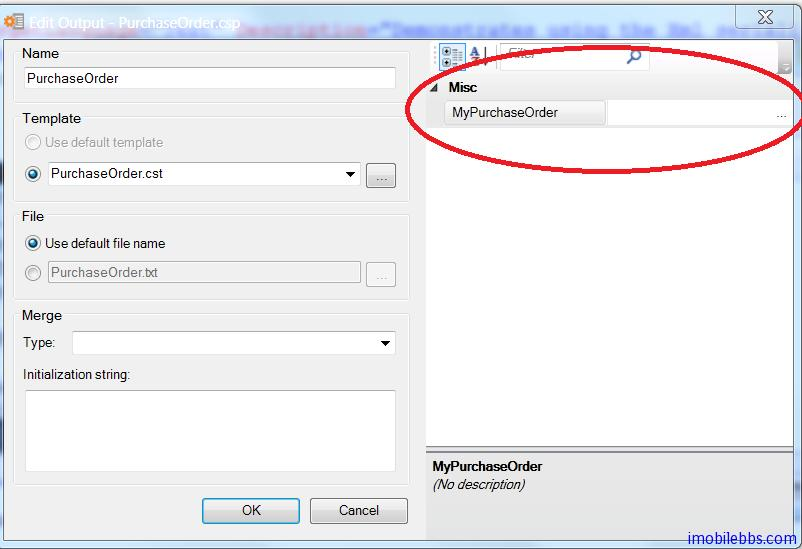

# 使用 XMLProperty

在前面 [CodeSmith 使用教程(6): 基本语法-声明和使用属性](http://www.imobilebbs.com/wordpress/archives/4207)介绍了 CodeSmith 中使用属性的基本方法，模板中的属性是通过 Property 指令来定义。

CodeSmith 也支持使用 XML 文档来定义属性，可以把一些配置属性定义到 XML 文件中，定义 XML 的属性是使用 XmlProperty 来定义：

```
<%@ XmlProperty Name="PurchaseOrder"
   Schema="PO.xsd"
   Optional="False"
   Category="Data"
   Description="Purchase Order to generate packing list for." %>
```

XmlProperty 指令可以有多个参数，除 Name 为必须的外，其它的参考都是可选的。

属性参数的介绍：

- Name：模版使用的参数的名称，必须为有效的模板语言名称，比如使用 C#，Name 必须为有效的 C#变量名。但提供 XML 的 Schema 文件时，这个变量的类型为一个 XmlDocument 实例。
- Schema：XML 属性对应的 Schema 文件名，可以用来校验存放 XML 属性的 XML 文件是否有效，如果提供了 Schema 文件，CodeSmith 在代码模板中支持 IntelliSense。
- Default：设置默认值。
- Category：用来说明这个属性在 CodeSmith Explorer 的属性面板中显示成什么类型，例如下拉选择、直接输入等。
- Description：在属性面板中对于这个属性的描述。
- Optional：设置这个属性是否是必须的，设置为 True 表明这个参数值可有可无，设置为 False 则这个参数必须有值。
- OnChanged 为属性发生变化时定义事件处理代码。
- RootElement： 指定 XML 根元素的相对路径。

本例使用 CodeSmith 自带的一个例子，使用 PurchaseOrder.xsd ，XML 的定义如下：

```
<?xml version="1.0" encoding="utf-8"?>
<xs:schema targetNamespace="http://www.codesmithtools.com/purchaseorder"
elementFormDefault="qualified"
xmlns="http://www.codesmithtools.com/purchaseorder"
xmlns:xs="http://www.w3.org/2001/XMLSchema">
  <xs:element name="PurchaseOrder">
    <xs:complexType>
      <xs:sequence>
        <xs:element name="OrderDate" type="xs:string" minOccurs="1" maxOccurs="1" />
        <xs:element name="SubTotal" type="xs:string" minOccurs="1" maxOccurs="1" />
        <xs:element name="ShipCost" type="xs:string" minOccurs="0" maxOccurs="1" />
        <xs:element name="TotalCost" type="xs:string" minOccurs="1" maxOccurs="1" />
        <xs:element name="ShipTo" minOccurs="0" maxOccurs="1">
          <xs:complexType>
            <xs:sequence>
              <xs:element name="Line1" type="xs:string" minOccurs="0" maxOccurs="1" />
              <xs:element name="City" type="xs:string" minOccurs="0" maxOccurs="1" />
              <xs:element name="State" type="xs:string" minOccurs="0" maxOccurs="1" />
              <xs:element name="Zip" type="xs:string" minOccurs="0" maxOccurs="1" />
            </xs:sequence>
            <xs:attribute name="Name" type="xs:string" />
          </xs:complexType>
        </xs:element>
        <xs:element name="Items" minOccurs="0" maxOccurs="1">
          <xs:complexType>
            <xs:sequence>
              <xs:element name="OrderedItem" minOccurs="0" maxOccurs="unbounded">
                <xs:complexType>
                  <xs:sequence>
                    <xs:element name="ItemName" type="xs:string" minOccurs="1" maxOccurs="1" />
                    <xs:element name="Description" type="xs:string" minOccurs="0" maxOccurs="1" />
                    <xs:element name="UnitPrice" type="xs:string" minOccurs="1" maxOccurs="1" />
                    <xs:element name="Quantity" type="xs:string" minOccurs="1" maxOccurs="1" />
                    <xs:element name="LineTotal" type="xs:string" minOccurs="1" maxOccurs="1" />
                  </xs:sequence>
                </xs:complexType>
              </xs:element>
            </xs:sequence>
          </xs:complexType>
        </xs:element>
      </xs:sequence>
    </xs:complexType>
  </xs:element>
</xs:schema>
```

与这个 XML Schema 配合使用的用来存放 XML 属性的 XML 文件为 SamplePurchaseOrder.xml ，其定义如下：

```
<?xml version="1.0"?>
<PurchaseOrder xmlns="http://www.codesmithtools.com/purchaseorder">
  <ShipTo Name="Eric J. Smith">
    <Line1>123 Test Dr.</Line1>
    <City>Dallas</City>
    <State>TX</State>
    <Zip>75075</Zip>
  </ShipTo>
  <OrderDate>05-01-2003</OrderDate>
  <Items>
    <OrderedItem>
      <ItemName>Item #1</ItemName>
      <Description>Item #1 Description</Description>
      <UnitPrice>5.45</UnitPrice>
      <Quantity>3</Quantity>
      <LineTotal>16.35</LineTotal>
    </OrderedItem>
    <OrderedItem>
      <ItemName>Item #2</ItemName>
      <Description>Item #2 Description</Description>
      <UnitPrice>12.75</UnitPrice>
      <Quantity>8</Quantity>
      <LineTotal>102.00</LineTotal>
    </OrderedItem>
  </Items>
  <SubTotal>45.23</SubTotal>
  <ShipCost>5.23</ShipCost>
  <TotalCost>50.46</TotalCost>
</PurchaseOrder>
```

定义一个简单的模板，把 SamplePurchaseOrder.xml 中的内容重新输出，可以在代码模板中定义一个XMLProperty ，其 Schema 指定为 PurchaseOrder.xsd

```
<%--
This template demonstates using the XmlProperty directive
--%>
<%@ CodeTemplate Language="C#" TargetLanguage="Text"
  Description="Demonstrates using the Xml serializer." %>
<%@ XmlProperty
   Name="MyPurchaseOrder"
   Schema="PurchaseOrder.xsd"
   Default="SamplePurchaseOrder.xml" %>
This file generated by CodeSmith on <%= DateTime.Now.ToLongDateString() %>

PurchaseOrder:
	Address:
		Name: <%= MyPurchaseOrder.ShipTo.Name %>
		Line1: <%= MyPurchaseOrder.ShipTo.Line1 %>
		City: <%= MyPurchaseOrder.ShipTo.City %>
		State: <%= MyPurchaseOrder.ShipTo.State %>
		Zip: <%= MyPurchaseOrder.ShipTo.Zip %>
	OrderDate: <%= MyPurchaseOrder.OrderDate %>
	Items:
		<% for (int i = 0; i < MyPurchaseOrder.Items.Count; i++) { %>
		<%= i %>:
			ItemName: <%= MyPurchaseOrder.Items[i].ItemName %>
			Description: <%= MyPurchaseOrder.Items[i].Description %>
			UnitPrice: <%= MyPurchaseOrder.Items[i].UnitPrice %>
			Quantity: <%= MyPurchaseOrder.Items[i].Quantity %>
			LineTotal: <%= MyPurchaseOrder.Items[i].LineTotal %>
		<% } %>
	SubTotal: <%= MyPurchaseOrder.SubTotal %>
	ShipCost: <%= MyPurchaseOrder.ShipCost %>
	TotalCost: <%= MyPurchaseOrder.TotalCost %>
```

模板中定义的 XML 属性名为 MyPurchaseOrder 对应的 Schema 为 PurchaseOrder.xsd ，因此在代码模板可以通过 MyPurchaseOrder.ShipTo.Name 的格式来直接引用 XML Schema 中定义的元素，CoddSmith 也支持 IntelliSense。

运行该模板，首先需要为 MyPurchaseOrder 选择合适的 XML 文件：



如果选择的文件不符合指定的 XML Schema，CodeSmith 不允许选择该文件，本例使用预先定义的SamplePurchaseOrder.xml ，生成的文件如下：

```
This file generated by CodeSmith on Saturday, 12 January 2013

PurchaseOrder:
	Address:
		Name: Eric J. Smith
		Line1: 123 Test Dr.
		City: Dallas
		State: TX
		Zip: 75075
	OrderDate: 05-01-2003
	Items:
		0:
			ItemName: Item #1
			Description: Item #1 Description
			UnitPrice: 5.45
			Quantity: 3
			LineTotal: 16.35
		1:
			ItemName: Item #2
			Description: Item #2 Description
			UnitPrice: 12.75
			Quantity: 8
			LineTotal: 102.00
	SubTotal: 45.23
	ShipCost: 5.23
	TotalCost: 50.46
```

本例[下载](http://www.imobilebbs.com/download/codesmith/XmlPropertyDemo.zip)

Tags: [CodeSmith](http://www.imobilebbs.com/wordpress/archives/tag/codesmith)