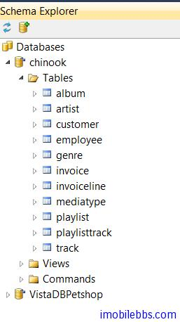
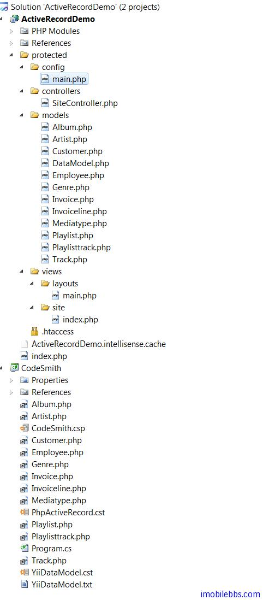

# 自动生成Yii Framework ActiveRecord类简单模板

上例介绍了使用 CodeSmith 编写代码模板的基本方法，本例实现一个较为实用的代码模板，通过数据库自动为 Yii Framework 生成所需要的 ActiveRecord 类。

本例通过修改[ Yii Framework 开发教程(26) 数据库-Active Record 示例](http://www.imobilebbs.com/wordpress/archives/4047)，原例是手工编写 Employee.php ActiveRecord。

首先为工程添加一个 C# 项目（任意类型，我们只是利用这个项目来包含 CodeSmith 项目），然后添加一个 CodeSmith 项目和一个 CodeSmith 模板。然后参考 [CodeSmith 使用教程(1): 概述](http://www.imobilebbs.com/wordpress/archives/3549) 使用Schema Explorer 添加一个数据连接，本例连接到 Chinook 数据库：



创建的代码模板 PhpActiveRecord.cst 定义个属性 TableName（数据库表名），复制 [Yii Framework 开发教程(26) 数据库-Active Record 示例](http://www.imobilebbs.com/wordpress/archives/4047)中 Employee.php 的定义并使用属性，代码如下：

```
<%@ Template Language="C#" TargetLanguage="PHP" Debug="False" %>

<%@ Property Name="TableName" Type="System.String" Description="Table name" %>

<?php

class <%= TableName %> extends CActiveRecord
{
	public static function model($className=__CLASS__)
	{
		return parent::model($className);
	}

	public function tableName()
	{
		return '<%= TableName %>';
	}
}

?>

<script runat="template">
  public override string GetFileName() {
    return TableName + ".php" ;
}
</script>
```

这时就可以通过定义 TableName 的属性给任意数据表生成对应的 ActiveRecord PHP 类了。 不过这还是要手工来一个一个来配置表名。 本例通过一个主模板和一个从模板的方式通过连接数据库自动为所有的表生成对应的 ActiveRecord

使用主从模板的具体用法后面再介绍，简单的说子模板相当于子函数，主模板类似于主函数可以调用子函数，主模板通过调用子模板，传给子模板属性从而可以生成多个文件。

创建一个代码模板 YiiDataModel.cst 作为主模板，使用子模板首先需要在主模板中进行注册才能使用：

```
<%@ Register Name="ActiveRecord" Template="PhpActiveRecord.cst" MergeProperties="false"  %>
```

完整代码如下：

```
<%@ CodeTemplate Language="C#" TargetLanguage="Text"
  Description="List all database tables" %>
<%@ Import Namespace="System.IO" %>
<%@ Property Name="SourceDatabase" Type="SchemaExplorer.DatabaseSchema"
  Category="Context" Description="Database containing the tables." %>

<%@ Register Name="ActiveRecord" Template="PhpActiveRecord.cst"
 MergeProperties="false"  %>
<%@ Assembly Name="SchemaExplorer" %>
<%@ Import Namespace="SchemaExplorer" %>

<script runat="template">
public string FirstLetterToUpper(string str)
{
    if (str != null)
    {
        if(str.Length > 1)
            return char.ToUpper(str[0]) + str.Substring(1);
        else
            return str.ToUpper();
    }
    return str;
}

</script>

<% for (int i = 0; i < SourceDatabase.Tables.Count; i++) { %>
   <%  string name= FirstLetterToUpper(SourceDatabase.Tables[i].Name); %>
   <%  string filename= @"../ActiveRecordDemo/protected/models/"+name+".php"; %>
     // instantiate the sub-template
    <%  ActiveRecord activeRecord = this.Create<ActiveRecord>();%>
    <%  activeRecord.TableName= name; %>
    <%  activeRecord.RenderToFile(filename,true); %>
<% } %>
```

FirstLetterToUpper 为C#函数，主要是把数据库表名的第一个字母变为大写（纯 C# 代码）。

SchemaExplorer 为 CodeSmith 提供的数据库访问库，可以用来获取数据库 Schema 的信息，如包含的表名，字段属性，主键外键等（后面具体介绍）

在主模板中，通过 ActiveRecord 来访问子模板（名字 ActiveRecord 为注册子模板时定义） ，使用 this.create 创建子模板实例，然后传入 TableName 属性，调用 RenderToFile 将子模板的结果写道指定的文件中。

此时在 CodeSmith.csp 中添加主模板，配置数据库为 Chinook，然后生成代码

```
Rendering output 'YiiDataModel'...

  Generated: D:\tmp\ActiveRecordDemo\ActiveRecordDemo\protected\models\Album.php
  Generated: D:\tmp\ActiveRecordDemo\ActiveRecordDemo\protected\models\Artist.php
  Generated: D:\tmp\ActiveRecordDemo\ActiveRecordDemo\protected\models\Customer.php
  Generated: D:\tmp\ActiveRecordDemo\ActiveRecordDemo\protected\models\Employee.php
  Generated: D:\tmp\ActiveRecordDemo\ActiveRecordDemo\protected\models\Genre.php
  Generated: D:\tmp\ActiveRecordDemo\ActiveRecordDemo\protected\models\Invoice.php
  Generated: D:\tmp\ActiveRecordDemo\ActiveRecordDemo\protected\models\Invoiceline.php
  Generated: D:\tmp\ActiveRecordDemo\ActiveRecordDemo\protected\models\Mediatype.php
  Generated: D:\tmp\ActiveRecordDemo\ActiveRecordDemo\protected\models\Playlist.php
  Generated: D:\tmp\ActiveRecordDemo\ActiveRecordDemo\protected\models\Playlisttrack.php
  Generated: D:\tmp\ActiveRecordDemo\ActiveRecordDemo\protected\models\Track.php
  Generated: D:\tmp\ActiveRecordDemo\CodeSmith\YiiDataModel.txt
Done rendering outputs: 1 succeeded, 0 failed, 0 skipped (1
```

刷新项目可以看到自动生成的代码文件



本例只是为每个数据表生成最简单的 ActiveRecord，如果需要生成关联 [ActiveRecord](http://www.imobilebbs.com/wordpress/archives/4052)，可以进一步根据表之间的关系为每个 ActiveRecord 生成所需的 relations 方法，后面有时间进一步介绍。

本例[下载](http://www.imobilebbs.com/download/codesmith/ActiveRecordDemo.zip)

Tags: [CodeSmith](http://www.imobilebbs.com/wordpress/archives/tag/codesmith)